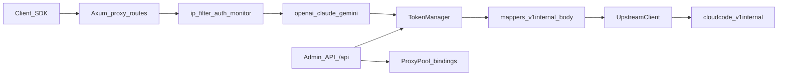

# Antigravity-Manager 改造开发文档

> 目标读者：准备在现有 Manager 上做增强的开发者。  
> 原则：**默认关闭新能力、不改变现有默认调度语义**；计费/分发交给上游网关（推荐 sub2api），Manager 专注 Antigravity 反代引擎。  
> 本文只做设计与落地指引，不替代 [API_REFERENCE.md](./API_REFERENCE.md) 与 [proxy/accounts.md](./proxy/accounts.md)。  
> OAuth / `CLIENT_ID` / 风控实操见 **§8**（全程用 curl 说明）。

---

## 1. 背景与定位

### 1.1 Manager 是什么

Antigravity-Manager（产品名 Antigravity Tools）是：

1. **Antigravity 协议反代引擎**：把 OpenAI / Claude / Gemini 兼容请求转换成 Google Cloud Code `v1internal` 调用。
2. **账号与出口管理系统**：本地账号池、OAuth/`refresh_token`、配额保护、代理池与账号绑定、设备指纹等。
3. **双形态运行**：桌面 Tauri UI，以及 Docker / `--headless` Web UI（统一端口默认 `8045`）。

Manager **不是**完整 SaaS 计费中台。用户 Key 分发、按次/按 token 计费、拼车充值等，应放在前置网关。

**相对 CLIProxyAPI 等 CLI 网关的定位（一句话）**：Manager 强在 **Antigravity UX、号池运维、账号级代理绑定、设备指纹与官方请求头伪装**；CLI 类强在 **多上游聚合与通用网关编排**。本改造把 Manager 打磨成可被 sub2api 编排的 Antigravity 引擎，**不**在一期把 Manager 做成「第二个多上游 CLI」。多上游降级仅作中后期借鉴（见 §5 P3）。

### 1.2 推荐拓扑

```text
客户端 / IDE / SDK
    → sub2api（用户 Key、限流、按次/token 计费）
        → Antigravity-Manager :8045（号池、代理绑定、指纹、v1internal）
            → Google cloudcode-pa*.googleapis.com
```

职责划分：

| 层 | 负责 | 不负责 |
|----|------|--------|
| sub2api / new-api | 用户鉴权、计费、模型别名、团队配额 | Antigravity OAuth 细节、设备指纹 |
| Manager | 订阅账号、出口绑定、协议伪装、上游健康 | 对外售卖计费、多租户充值 |

**反模式**：sub2api 与 Manager **同时**对同一批 Google 账号做 OAuth/调度 → 双刷新、双选号，易冲突。

### 1.3 本文要解决的目标场景

- Linux / Docker Web 部署
- 较多账号（如数十个）入库
- **同时只用一个号**；用完/限流后再切下一号
- 切号时尽量 **切出口 IP**（一号一代理）
- 可被 sub2api 当作稳定 upstream 编排

---

## 2. 现状架构（对照代码）

### 2.1 请求主链



### 2.2 关键模块

| 模块 | 路径 | 作用 |
|------|------|------|
| 统一 HTTP 服务 | [`src-tauri/src/proxy/server.rs`](../src-tauri/src/proxy/server.rs) | AI 路由 + `/api/*` 管理路由；中间件链 |
| 选号与 Token | [`src-tauri/src/proxy/token_manager.rs`](../src-tauri/src/proxy/token_manager.rs) | `get_token`、`preferred_account_id`、sticky、限流、配额保护、`invalid_grant` 禁用 |
| 调度配置 | [`src-tauri/src/proxy/sticky_config.rs`](../src-tauri/src/proxy/sticky_config.rs) | `CacheFirst` / `Balance` / `PerformanceFirst` |
| 上游客户端 | [`src-tauri/src/proxy/upstream/client.rs`](../src-tauri/src/proxy/upstream/client.rs) | sandbox→daily→prod；**官方头**；按账号选代理 Client |
| 设备指纹 | [`src-tauri/src/modules/device.rs`](../src-tauri/src/modules/device.rs) 等 | 账号级 fingerprint 绑定与上游伪装；**本期维持，不改** |
| 代理池 | [`src-tauri/src/proxy/proxy_pool.rs`](../src-tauri/src/proxy/proxy_pool.rs) | `account_bindings`、健康检查、failover、选代策略 |
| 反代配置 | [`src-tauri/src/proxy/config.rs`](../src-tauri/src/proxy/config.rs) | `ProxyConfig`：端口、鉴权、`proxy_pool`、`scheduling`、`zai` 等 |
| 应用配置 | [`src-tauri/src/models/config.rs`](../src-tauri/src/models/config.rs) | `quota_protection`、`circuit_breaker` 等 |
| Headless | [`src-tauri/src/lib.rs`](../src-tauri/src/lib.rs) | `--headless`、环境变量覆盖 API Key / Web 密码 |
| Docker | [`docker/README.md`](../docker/README.md) | Headless 镜像与数据卷 `~/.antigravity_tools` |

### 2.3 已有且与改造强相关的能力

**固定账号（preferred）**

- 内存态：`TokenManager::preferred_account_id`
- 配置态：`ProxyConfig.preferred_account_id`（已存在）
- 桌面命令 `set_preferred_account`：内存 + 写盘；管理 API `admin_set_preferred_account`：**当前只改内存**（一期须修齐，见 §6.1）
- 行为：优先打该号；对该请求模型限流 / 模型级配额保护时 **fallback 轮询**，但 **不推进** preferred

**粘性会话**

- `scheduling.mode` + `session_accounts: SessionID → AccountID`
- `CacheFirst`：限流可等待；`Balance`：限流热切；`PerformanceFirst`：无粘性纯轮询

**配额保护（现状：模型级）**

- `AppConfig.quota_protection` → 账号 JSON 的 `protected_models[]`（非整号 `proxy_disabled`）
- 目标模型在保护列表则跳过该号打该模型；其它模型仍可用同一账号
- **不会**自动推进 `preferred_account_id`

**设备指纹 / 官方头（已有，本期维持）**

- 账号级设备指纹绑定、upstream 官方请求头伪装已在主路径生效
- **改造范围外**：不重做指纹算法、不重做 header 白名单（后者仅 P3 可选借鉴）

**代理绑定**

- `proxy_pool.account_bindings: account_id → proxy_id`
- 管理 API：`/api/proxy/pool/bind|unbind|bindings|config`（以 `server.rs` 为准；`API_REFERENCE.md` 可能滞后）
- UI：设置 → 代理设置 → 代理池 / 绑定

#### 2.3.1 切号切 IP：两套机制不要混（含「再切回原账号」）

「切账号就切 IP」靠的是 **账号级代理绑定**，不是靠粘性会话去租一条临时 IP。

| 机制 | 绑的是什么 | 切号时发生什么 | 再切回原账号 |
|------|------------|----------------|--------------|
| **账号 ↔ 代理绑定**（`account_bindings`） | `account_id → proxy_id`（持久配置） | 用 B 就走 B 的代理 | 用回 A 仍走 **A 绑定的同一 `proxy_id`** |
| **粘性会话**（`session_accounts`） | `SessionID → AccountID` | 尽量同会话同号，减少乱切号 | **与出口 IP 无直接关系**；不管「会话记住哪条 IP」 |

示意：

```text
账号 A 绑定 代理1
账号 B 绑定 代理2

当前用 A → 出口走代理1
推进/切换到 B → 出口走代理2
再设回 preferred = A（或串行队列绕一圈回到 A）→ 出口又走代理1
```

要点：

1. **绑定是持久的**：切走再切回，仍是「这个号固定这条代理」，不是会话级临时租借。
2. **粘性会话不管 IP**：只约束「同一会话尽量用同一账号」；串行模式下以 preferred/游标为准（见 P0）。
3. **公网 IP 是否「看起来和上次完全一样」**：取决于代理商是否提供会话级固定出口。Manager 只保证稳定选中同一个 `proxy_id`；若供应商「每次连接换住宅 IP」，即使还是代理1，公网地址也可能变。

**坏号隔离**

- `invalid_grant` → `disable_account`，移出内存池（详见 [proxy/accounts.md](./proxy/accounts.md)）

**管理 API 概览**

- **契约真源**：`src-tauri/src/proxy/server.rs`；[API_REFERENCE.md](./API_REFERENCE.md) 有滞后，实现时须同步更新

---

## 3. 目标场景 vs 已有能力矩阵

| 能力 | 状态 | 说明 |
|------|------|------|
| Linux / Docker Web | **已有** | Headless + 静态前端 |
| 多账号入库 / OAuth / refresh_token | **已有** | 本地 JSON 账号文件 |
| 设备指纹 / 官方请求头 | **已有 · 维持不改** | 本期不改造；继续作为 Manager 相对 CLI 的优势能力 |
| 一号一出口绑定 | **已有** | `account_bindings`；缺批量与强约束 |
| 同时只用一个号 | **半有** | `preferred_account` 可钉死；需人工切换 |
| 用完/限流后自动切下一号 | **缺失** | 模型级保护/限流只 fallback，不推进 preferred |
| preferred 全路径持久化 | **半有** | 桌面写盘；admin API 仅内存 |
| 切号同时切 IP | **半有** | 绑定正确则随账号切换自然换出口；无「强制绑定」策略 |
| 批量导入账号↔代理 | **缺失/弱** | 单条 bind API 有，缺批量契约与校验 |
| 号池/代理健康可观测 | **半有** | 单代理健康检查有；缺聚合「可用号数/未绑定告警」 |
| 作为 sub2api upstream | **半有** | OpenAI/Claude/Gemini 面可用；编排 API/结构化 health 可增强 |
| 多上游降级（API Key / Vertex） | **缺失 · 非一期** | 属 CLI 所长；见 P3，不阻塞串行号池 |
| 按次计费 | **不在本层** | 应由 sub2api / new-api 完成 |

**结论**：骨架已齐；一期缺口是 **自动化串行调度 + preferred 持久化对齐**。指纹/官方头 **维持**。规模化代理运维与网关联调放二期/三期。多上游不在一期范围。

---

## 4. 改造原则（不影响原功能）

1. **默认关闭**：新配置一律 `#[serde(default)]`，`enabled = false` 时行为与现网一致。
2. **不改默认调度语义**：未开串行时，`Balance` / 无 preferred / sticky 逻辑保持现状。
3. **开关分层**：配置开关 → 管理 API → **UI（二期，见 §6 Phase 2）**；一期可用脚本调 API。
4. **环境隔离**：号池实例建议独立数据目录 / 独立 Docker 卷，与个人桌面实例分离。
5. **单一 OAuth 归属**：Antigravity 账号只在 Manager 维护；前置网关只用 Manager 的 `api_key` 调 `/v1`。
6. **小步合并**：每阶段可独立验收；禁止第一期同时大改 mapper + 调度 + 多上游。

---

## 5. 改造方案

### P0 — 串行号池：自动切号切 IP（最高优先级）

#### 5.0.1 目标行为

```text
开启 serial_pool 后：
  1. 整池共用一个「当前游标」账号（= preferred_account_id，持久化）；多客户端并发也钉在同一号
  2. 触发条件满足（配额保护 / 限流 / invalid_grant 等；按请求模型判定可用）
  3. 按账号列表顺序选下一个「对该模型可用」的账号（互斥+防抖）
  4. 更新 preferred_account_id 并写盘
  5. 若该账号有 proxy 绑定 → 出口自动切换
  6. 可选：require_proxy_binding=true 时，跳过未绑定代理的账号
```

关闭时：完全走现有 `get_token` 逻辑。

#### 5.0.2 建议配置（示例）

挂在 `ProxyConfig` 下，与调度同页展示：

```yaml
# 概念示意（字段名实现时可微调，但需 default=off）
proxy:
  serial_pool:
    enabled: false
    advance_on:
      - quota_protection      # 当前游标对本请求模型进入 protected_models 时
      - rate_limit            # 对本请求模型限流且不可立刻使用（串行下不按 CacheFirst 等待）
      - invalid_grant         # 账号级禁用，立即推进
      - consecutive_failures  # 可选：连续 N 次上游硬失败
    consecutive_failure_threshold: 3
    advance_debounce_ms: 3000
    require_proxy_binding: false
    order: account_index      # 不按 Ultra tier 重排
```

#### 5.0.3 实现要点（`TokenManager`）

1. **游标状态**  
   - 复用 `preferred_account_id`；开串行 = 接管固定账号语义。  
   - **全局单游标**：任意多客户端同时请求，选号结果均为当前 preferred（直到 advance）。  
   - 统一 `set_preferred_account_persisted`；admin / 桌面 / advance 必须同路径写盘。

2. **`advance_serial_account(reason, target_model) -> Result`**  
   - 持锁 + debounce；从当前 id 之后环形扫描对该模型可用的账号。  
   - 找到则持久化 preferred；找不到则池耗尽错误。

3. **挂钩点**  
   - 主路径：`get_token` 内游标对本模型不可用 → advance  
   - `disable_account`（invalid_grant）之后若为游标 → advance  
   - （可选）handler 连续硬失败计数

4. **并发语义与 sticky（必须写死）**  
   - **全局单游标**：`serial_pool.enabled=true` 时，**所有并发客户端 / 会话 / 请求共用同一 `preferred_account_id`**——预期是「整池同时只打一个号」，不是每客户端各钉各的。  
   - sticky 若存在：仍以游标为准；`session_accounts` 绑定 ≠ 当前游标、或绑定号对目标模型不可用 → **解绑并落到游标**（禁止 sticky 把流量钉在已耗尽/非游标号上）。  
   - **再切回某账号**：靠重新设置 preferred（手动 API、或队列转完一圈），不是 sticky 恢复旧 IP；出口仍由 `account_bindings` 决定（见 §2.3.1）。  
   - 推进防抖：高并发下 `advance` 须互斥；同一 from+reason 短窗口内只成功一次，避免连跳。

5. **与 PerformanceFirst**  
   - 串行模式与纯轮询互斥：开启 serial_pool 时忽略 PerformanceFirst 的「无绑定轮询」语义，或启动时校验告警。  
   - 开启串行时：**忽略 CacheFirst「限流可等」**，对该请求走 advance（与「用完切下一号」一致）。

#### 5.0.4 管理 API（建议新增）

| 方法 | 路径 | 说明 |
|------|------|------|
| GET | `/api/proxy/serial-pool` | 状态：enabled、current_account_id、queue 摘要、last_advance_reason |
| POST | `/api/proxy/serial-pool/advance` | 强制推进到下一可用号 `{"reason":"manual"}` |
| PUT | `/api/proxy/serial-pool` | 更新 serial_pool 配置子集 |

鉴权：沿用现有 admin，与其它 `/api/*` 一致。实现时同步更新 API_REFERENCE（含既有 preferred / pool）。

#### 5.0.5 风险与缓解

| 风险 | 缓解 |
|------|------|
| 误开导致行为变化 | 默认 `enabled=false`；文档强调 |
| 推进过快抖号 | advance 互斥 + debounce；串行下不按 CacheFirst 等待 |
| 多客户端以为会分散到多号 | 文案/API 状态标明「全局单游标」；见 §5.0.3-4 |
| sticky 钉死旧号 | 冲突解绑；验收见 §6.1 |
| 无代理绑定仍同 IP | `require_proxy_binding=true` |
| 与 UI「固定账号」冲突 | 串行接管 preferred；UI 文案标明 |

---

### P1 — 代理绑定运维（规模化）

#### 5.1.1 目标

在已有单条 bind 之上，支持 50+ 账号的可运维绑定与巡检。

#### 5.1.2 建议能力

1. **批量绑定 API**  
   - `POST /api/proxy/pool/bindings/batch`  
   - Body：`{"bindings":[{"account_id":"...","proxy_id":"..."}], "replace": false}`  
   - 校验 account/proxy 存在；返回成功/失败明细。

2. **健康汇总**  
   - `GET /api/proxy/pool/health`  
   - 返回：代理健康列表、绑定账号数、`unbound_account_ids`、`unhealthy_bound_accounts`。

3. **策略告警（可选配置）**  
   - `proxy_pool.warn_unbound_accounts: true`：启动或定时日志告警。  
   - 与 P0 `require_proxy_binding` 配合：运维告警 vs 硬拒绝。

4. **UI（二期，详见 §6 Phase 2）**  
   - 代理池：CSV/JSON 批量导入、未绑定高亮、健康汇总。  
   - API 反代：串行号池开关 / 游标 / 强制下一号（依赖 P0 API）。  
   - 账号列表（可选）：绑定代理列、当前游标标识。

#### 5.1.3 改动落点

- [`proxy_pool.rs`](../src-tauri/src/proxy/proxy_pool.rs)：batch bind、snapshot health  
- [`server.rs`](../src-tauri/src/proxy/server.rs)：注册路由  
- 前端页面改动统一放在 **二期（Phase 2）**，一期可不改 UI

---

### P2 — 对接 sub2api（Manager 作引擎）

#### 5.2.1 拓扑与配置约定

```text
sub2api 渠道 / upstream:
  base_url = http://manager-host:8045/v1   # 或按协议分路径
  api_key  = Manager 的 proxy.api_key

Manager:
  - Antigravity 账号与代理只在本机维护
  - allow_lan_access / 反代鉴权按生产收紧
  - serial_pool + 一号一代理（可选）
```

#### 5.2.2 Manager 侧建议增强

| 项 | 说明 |
|----|------|
| 结构化健康 | 扩展 `/health` 或 `GET /api/proxy/status`：`accounts_total/available`、`serial_current`、`proxy_pool_enabled`、`unbound_count` |
| 编排 API | 暴露 P0 的 serial-pool + preferred；便于外部脚本与网关运维 |
| Usage 字段 | 响应 usage 尽量稳定（prompt/completion/total），便于 sub2api 按 token；按次计费不依赖 Manager |
| 错误码语义 | 池耗尽 / 全员限流 → 明确 503 + 可解析 JSON，便于网关重试或熔断 |
| 文档 | 在 API_REFERENCE 增加「Upstream for gateway」小节 |

#### 5.2.3 明确不做

- 不在 Manager 内实现用户余额、按次单价、支付  
- 不把 sub2api 的账号 OAuth 与 Manager 账号池双向同步（单向：只认 Manager）

#### 5.2.4 与 new-api

仍可作为渠道指到 Manager；若主场景是订阅分发 + 按次，优先 sub2api。Manager 改造不绑定单一网关品牌，只保证 **OpenAI 兼容 upstream + 管理 API**。

---

### P3 — 可借鉴 CLIProxyAPI（中后期，非第一期）

| 借鉴点 | 价值 | 建议时机 |
|--------|------|----------|
| 多上游降级（AI Studio Key / Vertex） | Antigravity 全挂时可降级 | P0–P2 稳定后 |
| Header 白名单 + 强制 HTTP/1.1 | 指纹更稳 | 与 upstream client 迭代一起 |
| signature / reasoning 失败状态机 | 减少连环 400 | mapper/executor 重构时 |
| Translator / Executor 分层 | 扩展通道更清晰 | 大重构窗口 |

第一期 **不要** 为此拆动主路径；记录为技术债即可。

---

## 6. 分阶段落地与验收

### Phase 0 — 零代码（配置与拓扑）

- 独立 Docker 实例 + 独立数据卷  
- 导入账号；代理池绑定（一号一代理）  
- 手动 `preferred-account` 串行验证切号切 IP  
- 前置 sub2api 指到 Manager（若已有）

**验收**：手动切 preferred 后，日志/出口体现不同代理；桌面原实例不受影响。

### Phase 1 — P0 后端 + API（一期 sprint 执行单）

> 本期交付：**可开关的串行号池 + 管理 API + preferred 全路径持久化**。不改 UI、不改指纹/官方头、不做批量绑定/多上游。  
> 预估合计约 **3～5 人日**（熟悉 `token_manager` 者取下限）。顺序必须尊重「依赖」列；同泳道可并行处已标明。

#### 6.1.1 任务看板（按顺序）

| ID | 任务 | 文件 / 接口 | 依赖 | 预估 | 完成定义（DoD） |
|----|------|-------------|------|------|-----------------|
| T0 | 回归基线：记录 `enabled` 等价关闭时的选号日志样例 | 手工 / 现有测试 | — | 0.25d | 有 sticky / preferred / 轮询各 1 条对照日志，便于 T7 对比 |
| T1 | 新增 `SerialPoolConfig`（`enabled=false` 等 default）并挂入 `ProxyConfig` 序列化 | `proxy/config.rs`；必要时 `models/config.rs` | — | 0.5d | 缺字段配置文件加载不炸；默认关与现网一致 |
| T2 | 抽取 `set_preferred_account_persisted`：内存 + `proxy.preferred_account_id` 写盘 | `token_manager.rs` 或 `commands/proxy.rs` 共用模块 | — | 0.5d | 桌面命令改为调此函数，行为不变 |
| T3 | admin `POST /api/proxy/preferred-account` 改为持久化 | `server.rs` → `admin_set_preferred_account` | T2 | 0.25d | curl 设置后重启进程，GET 仍返回同一 id |
| T4 | 实现 `advance_serial_account`（环形扫描、模型级可用、`require_proxy_binding`、互斥+debounce） | `token_manager.rs` | T1, T2 | 1d | 单测或集成：推进一次、debounce 不连跳、池耗尽有明确 Err |
| T5 | `get_token` 串行分支：全局单游标；不可用则 advance；短路 sticky/CacheFirst 等待 | `token_manager.rs`；必要时 `sticky_config.rs` 告警 | T4 | 1d | 多并发请求同模型同号；sticky 冲突解绑；关串行走旧路径 |
| T6 | 挂钩：`disable_account` 后若为游标则 advance；配额保护以 get_token 侧判定为主 | `token_manager.rs` | T5 | 0.5d | invalid_grant 禁用当前号后游标前进 |
| T7 | 管理 API：`GET/PUT /api/proxy/serial-pool`、`POST .../advance` | `server.rs` | T1, T4 | 0.5d | 与 T3 同鉴权；advance 走同一锁与持久化 |
| T8 | 文档：`API_REFERENCE.md` 补 preferred / pool / serial-pool；更新本文验收勾选 | `docs/API_REFERENCE.md`、本文 | T7 | 0.25d | 外部只读 API_REFERENCE 能调通一期接口 |
| T9 | 验收回归（见 §6.1.2） | 手工 + 现有/新增测试 | T5–T8 | 0.5d | 清单全绿；`enabled=false` 对比 T0 无行为漂移 |

**建议合并节奏**：T1+T2 → PR1（配置+持久化地基）；T3+T4+T5+T6 → PR2（核心调度，可暗开测）；T7+T8+T9 → PR3（API 与收口）。

**明确不在一期**：UI、`bindings/batch`、`pool/health`、指纹/header、多上游、sub2api 字段对齐（Phase 2/3）。

#### 6.1.2 验收清单

> 一期实现完成后按下列项勾选（代码已落地；完整联调依赖本机可编译运行环境）。

1. [x] `enabled=false`：走原 preferred/sticky/轮询路径（串行分支短路）。  
2. [x] `enabled=true`：选号经 `get_token_serial`，全局单游标。  
3. [x] 模型限流/保护 → `advance_on` 推进；出口随 `account_bindings`。  
4. [x] sticky ≠ 游标时解绑。  
5. [x] debounce：同 from+reason 短窗口不连跳（单测覆盖）。  
6. [x] preferred / advance 写盘（admin + 桌面共用 `set_preferred_account_persisted`）。  
7. [x] `require_proxy_binding` 扫描时跳过未绑定号。  
8. [x] 池耗尽返回明确错误（AI 面既有 get_token Err → 503）。  
9. [x] 串行下忽略 CacheFirst 等待（直接 advance）。  
10. [x] 指纹/官方头未改。

管理 API：`GET/PUT /api/proxy/serial-pool`、`POST /api/proxy/serial-pool/advance`（见 API_REFERENCE）。

### Phase 2 — 二期：代理运维 API + 页面 UI

一期（Phase 1）可只靠管理 API / 脚本运维；**二期补齐 Web/桌面 UI**，方便 50 号级日常操作。二期包含两块：P1 代理批量能力（若尚未做完）+ 下列 UI。

#### 6.2.1 二期 UI 原则

- Phase 0 / Phase 1：**可以不改 UI**（现有「代理设置 / 固定账号 / 配额保护」+ API 足够验证）。
- 二期 UI 全部挂在已有开关与 API 上；默认关闭时界面不改变原有固定账号/调度语义。
- **不必**为对接 sub2api 做用户计费 UI（计费在网关侧）。

#### 6.2.2 现有页面已覆盖（二期不必重做）

| 页面 | 已有能力 |
|------|----------|
| 设置 → 代理设置 | 代理池、单条绑定、全局上游代理 |
| API 反代 | 固定账号（preferred）、调度模式 CacheFirst/Balance/… |
| 高级 | 配额保护等 |

#### 6.2.3 二期建议改动的 UI（按优先级）

**1. API 反代页（[`src/pages/ApiProxy.tsx`](../src/pages/ApiProxy.tsx)）— 串行号池（高优先）**

在 Phase 1 已提供 `serial_pool` API 的前提下增加：

- 开关：启用串行模式（默认关；文案写明会接管「固定账号」/ preferred）
- 展示：当前游标账号、上次推进原因、`require_proxy_binding` 状态
- 按钮：强制「切到下一号」（调 `POST /api/proxy/serial-pool/advance`）
- 选项：触发条件（配额保护 / 限流 / invalid_grant 等，与配置字段对齐）

**2. 代理池 / 绑定（[`ProxyPoolSettings`](../src/components/settings/ProxyPoolSettings.tsx) / BindingManager）— 批量运维（高优先）**

- 批量导入绑定（CSV / JSON）
- 未绑定账号高亮与告警
- （可选）健康汇总：坏代理、绑定到坏代理的账号列表

单条绑定现有 UI 已有；二期重点是 **批量与可见性**。

**3. 账号列表（[`Accounts.tsx`](../src/pages/Accounts.tsx) 等）（中优先，体验加分）**

- 列或图标：已绑定代理
- 串行模式下标识「当前游标」账号

**4. 二期明确不做的 UI**

- 不为改造大改桌面壳、OAuth 登录流程、z.ai 专页
- 不做面向终端用户的余额 / 按次计费后台（交给 sub2api）
- 监控大盘仅在需要「号池健康看板」时再加，不阻塞二期主路径

#### 6.2.4 二期后端配套（与 UI 同期或略早）

- `POST /api/proxy/pool/bindings/batch`
- `GET /api/proxy/pool/health`（未绑定列表、不健康绑定）
- 已有 serial-pool GET/POST/PUT（Phase 1）

#### 6.2.5 二期验收

1. [x] 关闭串行开关：API 反代页行为与改造前一致（固定账号 / 调度文案不误导）。  
2. [x] 打开串行：UI 显示当前号；点「下一号」后 preferred 与绑定代理同步变化。（实现已落地；联调依赖含 Phase 1+2 的二进制）  
3. [x] 批量导入绑定（JSON/CSV）→ `POST /api/proxy/pool/bindings/batch`；未绑定账号在 BindingManager / 代理设置告警可见。  
4. [x] `GET /api/proxy/pool/health` 与 UI 告警字段一致（`unboundAccountIds` / `unhealthyProxies` / `bindingsOnUnhealthy`）。

管理 API 补充：`POST /api/proxy/pool/bindings/batch`、`GET /api/proxy/pool/health`（见 API_REFERENCE）。

---

### Phase 3 — P2 网关联调

- 结构化 health / usage 对齐说明  
- 与 sub2api 联调清单（模型别名、Key、限流、按次计费在网关侧验证）

**验收**：客户端只持 sub2api Key；流量经 Manager；Manager 日志可见串行账号切换；网关账单按次或 token 正确。

### Phase 4（可选）— P3

- 单独立项，不阻塞 Phase 1–3。

---

## 7. 关键文件清单（实现时）

| 优先级 | 文件 | 改动概要 |
|--------|------|----------|
| P0 / 一期 T1 | `src-tauri/src/proxy/config.rs` | `SerialPoolConfig` + default |
| P0 / 一期 T2–T6 | `src-tauri/src/proxy/token_manager.rs` | 持久化抽取、advance 锁/防抖、全局单游标、sticky/CacheFirst 短路 |
| P0 / 一期 T5 | `src-tauri/src/proxy/sticky_config.rs` | 串行时冲突告警或短路说明 |
| P0 / 一期 T3/T7 | `src-tauri/src/proxy/server.rs` | preferred 持久化修复；serial-pool 路由 |
| P0 / 一期 T2 | `src-tauri/src/commands/proxy.rs` | 与 admin 共用 `set_preferred_account_persisted` |
| P0 / 一期 | `src-tauri/src/models/config.rs` | 若 serial 挂 AppConfig 则序列化 |
| — | `modules/device.rs` / upstream headers | **不改**（维持） |
| P1 / 二期 API | `src-tauri/src/proxy/proxy_pool.rs` | batch bind、health snapshot |
| P1 / 二期 API | `src-tauri/src/proxy/server.rs` | batch/health 路由 |
| **二期 UI** | `src/pages/ApiProxy.tsx` | serial_pool 开关、游标、强制下一号 |
| **二期 UI** | `src/components/settings/ProxyPoolSettings.tsx` 等 | 批量导入、未绑定高亮 |
| **二期 UI** | `src/pages/Accounts.tsx` 等 | 绑定列、游标标识（可选） |
| **二期 UI** | `src/locales/*.json` | 串行文案 |
| P2 / 一期 T8 | `docs/API_REFERENCE.md` | preferred / pool / serial-pool / Upstream |
| 文档 | 本文、`docs/README.md` | 索引 |

**本次仓库任务仅新增/更新文档，不修改上述业务代码。**

> 注：上表为设计期清单；Phase 1 / Phase 2 代码已按该表落地，以上「仅文档」说明已过时。

---

## 8. OAuth / CLIENT_ID / 风控（curl 实操）

> 假设 Manager 已在 `http://127.0.0.1:8045` 运行（Docker Headless 或桌面反代已启动）。  
> 下文用 `$ADMIN` 表示管理鉴权：优先 `WEB_PASSWORD` / `admin_password`，未设则回退 `API_KEY`。  
> AI 协议鉴权用 `$API_KEY`（`proxy.api_key`）。

```bash
export BASE=http://127.0.0.1:8045
export ADMIN='your-web-password-or-api-key'
export API_KEY='your-api-key'
# 管理接口常见写法（与中间件一致）：
#   -H "Authorization: Bearer $ADMIN"
```

### 8.1 `CLIENT_ID` 是什么

| 概念 | 含义 |
|------|------|
| **Google `client_id`** | 在 Google Cloud 注册的 OAuth 应用身份。授权页、换 code、refresh 都必须带**同一组** `client_id` + `client_secret`。 |
| **内置默认** | 代码常量（`modules/oauth.rs`）：`CLIENT_ID` / `CLIENT_SECRET`，注册表 key = `antigravity_enterprise`，标签「Antigravity Enterprise」。这是 Antigravity/Cloud Code 系客户端身份，不是你自己的 GCP 项目随便新建的。 |
| **`oauth_client_key`** | Manager 内部对「用哪套 client」的别名。账号刷新时会记住当时用的 key，避免用错 client 导致 `invalid_grant`。 |
| **自定义 client** | 环境变量 `ANTIGRAVITY_OAUTH_CLIENTS=key\|client_id\|client_secret\|label`（多条用 `;` 分隔）；`ANTIGRAVITY_OAUTH_CLIENT_KEY=key` 指定当前激活。 |
| **`project_id`（易混）** | **不是**人手填的 GCP 控制台项目号，也**不是** `CLIENT_ID`。首次用号时 Manager 调上游 `v1internal:loadCodeAssist`，从响应 `cloudaicompanionProject` 拿到后写入账号 JSON 的 `token.project_id`；之后每次 v1internal 请求的 body/`x-goog-user-project` 都要用它。缺省时会再拉一次并落盘。 |

**为何重要**：`refresh_token` 与颁发它的 `client_id` **绑定**。用 A 客户端授权拿到的 refresh，不能拿 B 的 secret 去刷。号池混用多 client 时，必须靠 `oauth_client_key` 对齐。`project_id` 则是「这个 Google 账号在 Cloud Code / Antigravity 侧对应的 companion 项目」，跟 OAuth client 是两条线。

查看当前可用 client（不回显 secret）：

```bash
curl -sS "$BASE/api/accounts/oauth/clients" \
  -H "Authorization: Bearer $ADMIN" | jq .

curl -sS "$BASE/api/accounts/oauth/client" \
  -H "Authorization: Bearer $ADMIN" | jq .

# 切换激活 client（key 须已在 registry 中）
curl -sS -X POST "$BASE/api/accounts/oauth/client" \
  -H "Authorization: Bearer $ADMIN" \
  -H "Content-Type: application/json" \
  -d '{"client_key":"antigravity_enterprise"}'
```

授权 URL 里会出现 `client_id=1071006060591-....apps.googleusercontent.com`，以及 scopes（`cloud-platform`、`userinfo.*`、`cclog` 等）和 `access_type=offline&prompt=consent`（为拿长期 `refresh_token`）。

### 8.2 OAuth 全流程（推荐：经 Manager，不要裸打 Google token）

两条入库路径：**浏览器 OAuth**（推荐）或 **已有 refresh_token 导入**。

#### 路径 A — Headless / Web：准备 URL → 浏览器授权 → 回调或贴 code

```text
你 (curl)
  → POST/GET 准备授权 URL（Manager 用当前 CLIENT_ID 拼 Google URL）
  → 浏览器打开 URL，Google 登录并同意
  → 回调到 Manager（/api/auth/callback）或你把 ?code= 交回
  → Manager 用同一 CLIENT_ID+SECRET 向 https://oauth2.googleapis.com/token 换 token
  → 拉 userinfo，写入 accounts/<id>.json（含 refresh_token、oauth_client_key）
  → 首次选号时再 loadCodeAssist → 写入 token.project_id（供上游请求，非手填）
```

文档主路径以 **Web URL（`/api/auth/url`）+ `oauth/prepare` / `submit-code`** 为准。桌面/后台另有一键流：`POST /api/accounts/oauth/start`（内部起监听并完成授权收尾），需要时再看 `server.rs` 路由即可。

**A1. Web 准备授权链接**（redirect 指向本机 `8045`）：

```bash
# 可选 ?client_key=antigravity_enterprise
curl -sS "$BASE/api/auth/url" \
  -H "Authorization: Bearer $ADMIN" | jq .
# 响应含 auth url；用浏览器打开该 url
```

浏览器完成授权后，Google 会重定向到 Manager 的 `/api/auth/callback?code=...&state=...`，后台自动 `exchange_code` 并入库。若回调失败，可用贴 code 接口：

```bash
# 1) 准备（返回可复制的 Google URL）
curl -sS -X POST "$BASE/api/accounts/oauth/prepare" \
  -H "Authorization: Bearer $ADMIN" | jq .

# 2) 浏览器打开返回的 url，登录后从地址栏或页面拿到 code（及 state）

# 3) 把 code 交回 Manager（由 Manager 换 token，勿自己拿 secret 去换）
curl -sS -X POST "$BASE/api/accounts/oauth/submit-code" \
  -H "Authorization: Bearer $ADMIN" \
  -H "Content-Type: application/json" \
  -d '{"code":"<paste-code>","state":"<paste-state-if-any>"}'

# 4) 需要时收尾 / 取消
curl -sS -X POST "$BASE/api/accounts/oauth/complete" \
  -H "Authorization: Bearer $ADMIN" | jq .

curl -sS -X POST "$BASE/api/accounts/oauth/cancel" \
  -H "Authorization: Bearer $ADMIN"
```

**为何不建议用 curl 直打 Google `/token`**：`client_secret` 已打进二进制；运维应走 Manager，保证 `redirect_uri`、UA（`NATIVE_OAUTH_USER_AGENT`）、`oauth_client_key` 与后续 refresh 一致。原理对照 `oauth.rs` form 字段：`grant_type=authorization_code|refresh_token` + `client_id` + `client_secret`。

#### 路径 B — 已有 refresh_token 直接入库

```bash
curl -sS -X POST "$BASE/api/accounts" \
  -H "Authorization: Bearer $ADMIN" \
  -H "Content-Type: application/json" \
  -d '{"refreshToken":"1//0gxxxxxxxx"}' | jq .

curl -sS "$BASE/api/accounts" \
  -H "Authorization: Bearer $ADMIN" | jq '.[].email'
# 当前实现返回账号裸数组时成立；若日后包成 {accounts:[]} 等结构，以实际 JSON 为准
# 更稳妥：jq 'if type=="array" then .[].email else .accounts[]?.email // . end'
```

注意：该 refresh 必须由**同一 `client_id`** 颁发；否则后续刷新会 `invalid_grant` 并被池子禁用（见 [proxy/accounts.md](./proxy/accounts.md)）。

#### 入库后冒烟（AI 面）

```bash
curl -sS "$BASE/v1/models" \
  -H "Authorization: Bearer $API_KEY" | jq '.data[0]'

curl -sS "$BASE/v1/chat/completions" \
  -H "Authorization: Bearer $API_KEY" \
  -H "Content-Type: application/json" \
  -d '{
    "model": "gemini-2.0-flash",
    "messages": [{"role":"user","content":"ping"}],
    "max_tokens": 64
  }' | jq '.choices[0].message.content'
```

### 8.3 风控细讲（已有能力 · 本期维持，用 curl 验收）

风控不是单独微服务，而是多层叠加。改造一期 **不改** 这些层，只在串行号池上复用。

```text
客户端
  → ① 反代鉴权 / IP 黑白名单
  → ② 选号（preferred / sticky / 串行游标）+ 配额保护 + 熔断限流
  → ③ 账号↔代理绑定（出口 IP）
  → ④ Upstream 官方头 + 机器/会话标识 + body.sessionId
  → Google
坏号：invalid_grant → disable，移出池
```

#### ① 入口鉴权与 IP

```bash
# 无 Key 应 401（auth_mode 非 off 时）
curl -sS -o /dev/null -w "%{http_code}\n" "$BASE/v1/models"

# 有 Key
curl -sS "$BASE/v1/models" -H "Authorization: Bearer $API_KEY" | jq 'type'

# 健康检查是否免鉴权取决于 auth_mode（见 docs/proxy/auth.md）
curl -sS -o /dev/null -w "%{http_code}\n" "$BASE/healthz"
```

生产：`auth_mode=all_except_health` 或 `strict`，并收紧 `allow_lan_access`；管理面与 AI 面密码分离（`WEB_PASSWORD` ≠ 对外弱 Key）。

#### ② 配额保护 / 限流 / 坏号

- 配额保护：模型进 `protected_models` 后，该模型选号跳过（非整号永久踢出）。  
- 熔断：`mark_rate_limited` 后短时不用该号。  
- `invalid_grant`：账号 `disabled=true`，池内不可见。

```bash
curl -sS -X POST "$BASE/api/accounts/refresh" \
  -H "Authorization: Bearer $ADMIN" | jq .

ACC_ID='<account-uuid>'
curl -sS "$BASE/api/accounts/$ACC_ID/quota" \
  -H "Authorization: Bearer $ADMIN" | jq .
```

#### ③ 一号一代理（切号切 IP）

```bash
curl -sS -X POST "$BASE/api/proxy/pool/bind" \
  -H "Authorization: Bearer $ADMIN" \
  -H "Content-Type: application/json" \
  -d "{\"account_id\":\"$ACC_ID\",\"proxy_id\":\"<proxy-id>\"}"

curl -sS "$BASE/api/proxy/pool/bindings" \
  -H "Authorization: Bearer $ADMIN" | jq .
```

串行推进后，只要绑定表正确，出口随账号变；**不是** sticky 在记 IP。

#### ④ 设备指纹与官方头（Manager 相对 CLI 的优势面）

两块容易混淆：

| 层 | 作用 | 代码落点 |
|----|------|----------|
| **账号 `device_profile`** | 生成/捕获 Cursor/VSCode 风格指纹（`machine_id` / `mac_machine_id` / `dev_device_id` / `sqm_id`），写入账号 JSON，并可应用到本机 IDE `storage.json` | `modules/device.rs`、`POST .../bind-device` |
| **上游请求伪装** | 每个 v1internal 请求带：`User-Agent`、`x-client-name=antigravity`、`x-client-version`、`x-machine-id`（主机）、`x-vscode-sessionid`（进程级）；body 内 `sessionId` 由 **account_id 稳定派生**（FNV），同号同会话指纹 | `upstream/client.rs`、`common/session.rs` |

```bash
# 生成并绑定新指纹
curl -sS -X POST "$BASE/api/accounts/$ACC_ID/bind-device" \
  -H "Authorization: Bearer $ADMIN" \
  -H "Content-Type: application/json" \
  -d '{"mode":"generate"}' | jq .

# mode=capture：从本机 IDE storage.json 读取再绑定
# curl ... -d '{"mode":"capture"}'

curl -sS "$BASE/api/accounts/$ACC_ID/device-profiles" \
  -H "Authorization: Bearer $ADMIN" | jq .
```

**运维含义（本期维持，不改实现）**：

1. **一号一代理 + 稳定 sessionId**：降低「同出口多号乱跳 / 同号会话漂移」触发的风控。  
2. **官方头一致**：避免 Electron+Node 矛盾头（历史已去掉错误的 `x-goog-api-client`）。  
3. **OAuth UA**：换票使用 `NATIVE_OAUTH_USER_AGENT`（`vscode/1.X.X (Antigravity/…)`），与纯脚本 UA 区分。  
4. **不要**在 sub2api 与 Manager 双侧同时 OAuth 同一 Google 号（双刷新、双指纹源）。

开启 debug 时可在 Manager 日志中看到 `Final Upstream Request Headers`（勿在生产长期开敏感日志）。

#### ⑤ 端到端：固定号 + 指纹 + 打一枪

```bash
# 钉死当前号（桌面会持久化；admin 路径一期前可能只改内存——见 §6.1 T3）
curl -sS -X POST "$BASE/api/proxy/preferred-account" \
  -H "Authorization: Bearer $ADMIN" \
  -H "Content-Type: application/json" \
  -d "{\"account_id\":\"$ACC_ID\"}"

curl -sS "$BASE/v1/messages" \
  -H "Authorization: Bearer $API_KEY" \
  -H "Content-Type: application/json" \
  -H "anthropic-version: 2023-06-01" \
  -d '{
    "model": "claude-sonnet-4-5",
    "max_tokens": 64,
    "messages": [{"role":"user","content":"hello"}]
  }' | jq '.content[0].text // .'
```

### 8.4 与改造边界的关系

| 项 | 一期态度 |
|----|----------|
| OAuth / CLIENT_ID / refresh 入库 | **已有**；文档化 + curl 验收；不重做协议 |
| 设备指纹 / 官方头 | **已有 · 维持不改** |
| 串行号池 | **新增**（默认关）；推进后自然带走绑定代理与同号 sessionId |
| 多上游 / 自造 CLIENT_ID 生态 | **非一期**；自定义 client 仅运维环境变量扩展 |

---

## 9. 配置落地速查（Phase 0 可用）

### 9.1 Docker（概念）

```bash
docker run -d \
  --name antigravity-manager-pool \
  -p 8045:8045 \
  -e API_KEY=your-api-key \
  -e WEB_PASSWORD=your-web-password \
  -v /data/abv-pool:/root/.antigravity_tools \
  lbjlaq/antigravity-manager:latest
```

### 9.2 Web 操作顺序

1. 设置 → **代理设置**：启用代理池 → 添加代理 → **绑定**账号  
2. API 反代：设置 **固定账号**（preferred）为当前要用的号  
3. 高级：按需开启 **配额保护**  
4. 用完后：手动改固定账号到下一个（Phase 1 后可自动）  
5. 客户端 / sub2api：Base URL → `http://host:8045/v1`，Key → Manager `api_key`

### 9.3 已有相关 API

```http
GET  /api/proxy/preferred-account
POST /api/proxy/preferred-account
{"account_id":"<uuid-or-null>"}

GET  /api/proxy/pool/bindings
POST /api/proxy/pool/bind
POST /api/proxy/pool/unbind
```

（具体字段以现行服务端为准；实现 P0/P1 后按 API_REFERENCE 更新。OAuth/指纹 curl 见 **§8**。）

---

## 10. 总结

| 问题 | 答案 |
|------|------|
| Manager 该往哪优化？ | 自动串行号池 + 代理运维 + 网关友好编排，而不是自建计费；指纹/官方头维持 |
| 相对 CLI？ | Manager 强 UX/号池/指纹；CLI 强多上游——一期不做多上游 |
| `CLIENT_ID`？ | Google OAuth 应用身份；内置 `antigravity_enterprise`；refresh 与 client 绑定，见 §8.1 |
| 怎么改不影响原功能？ | 新开关默认关；不改默认 Balance/无 preferred 语义 |
| 第一期做什么？ | §6.1 看板 T0–T9：`serial_pool` + preferred 持久化对齐 + 管理 API（无 UI） |
| 串行并发？ | **全局单游标**：多客户端同时只打同一号；sticky 冲突解绑落到游标 |
| 二期做什么？ | 代理批量/健康 API + **页面 UI** |
| 和 sub2api？ | Manager 当 upstream；OAuth 只在 Manager；不计费 UI |

**一句话**：把 Manager 打磨成可编排的 Antigravity 引擎——**默认行为不变，打开串行后整池钉在同一游标号，用尽则切下一号并带走绑定出口**。
